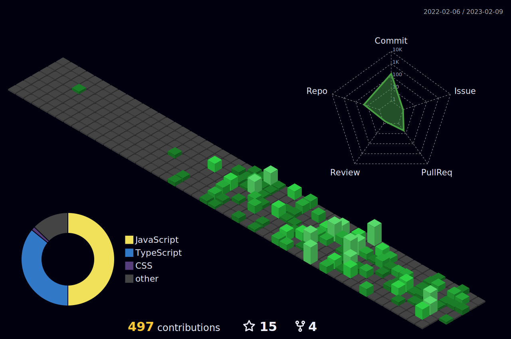

👋 Olá, eu sou @JuniorSantos1986, de Recife - PE - Brasil.

 
 
  Sou desenvolvedor web Full-stack, aqui estão alguns de meus projetos, meu grande objetivo é entrar em uma empresa onde eu seja desafiado  a colocar em prática todo o meu conhecimento.
   
   
  Sou apaixonado por tecnologia, passo várias horas de meu dia estudando novas tecnologias e formas melhores de aplicá-las.
   
   
  Nas minhas horas vagas, gosto de estar com minha família e praticar atividades físicas.

 
 
 
 
 
 
 
 

### ⚙️ Algumas tecnologias e ferramentas que utilizo

<code></code>
<code></code>
<code></code>
<code></code>
<code></code>
<code></code>
<code></code>

### 🚀 Outras estastísticas

  
  
  

<!---
guicastro13/guicastro13 is a ✨ special ✨ repository because its `README.md` (this file) appears on your GitHub profile.
You can click the Preview link to take a look at your changes.
--->
